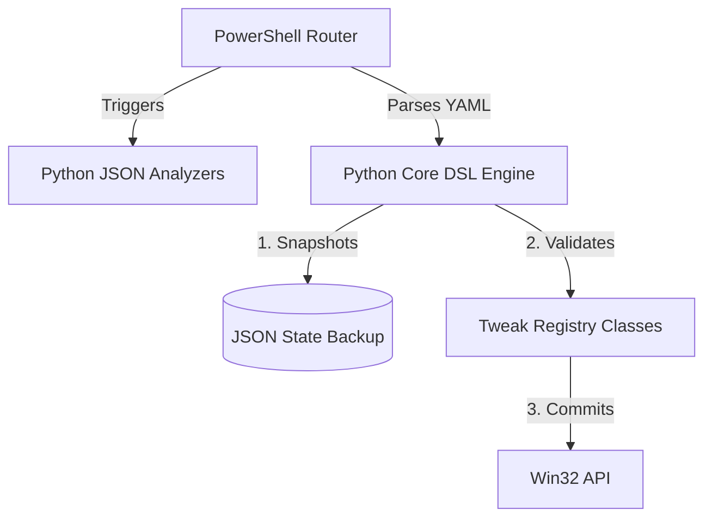

<div align="center">
  
  <h1>🔋 PowerTune</h1>
  <p><b>The Ultimate Systems Observability & Power Intelligence Platform for Windows</b></p>

  [](https://github.com/Sarvadnya07/powertune/actions/workflows/ci.yml)
  [](https://opensource.org/licenses/MIT)
  [](https://www.python.org/downloads/)
  [](https://microsoft.com/PowerShell)
</div>

---

## 📖 Overview
PowerTune is not an "optimizer script". It is an **evidence-driven, zero-trust power intelligence framework**. Designed for Systems Engineers, Developers, and Power Users, it replaces dangerous registry hacks with a completely transparent, declarative YAML execution engine. 

PowerTune tracks exactly what processes wake your CPU, identifies DPC latency spikes, blocks malicious injections via an Intent Firewall, and guarantees 100% reversible changes via an Atomic Rollback snapshot system.

## ✨ Elite Features
- 🛡️ **Intent Firewall**: Hardcoded sandboxing blocks changes to critical Windows OS services (e.g., Defender, RPC).
- 🧩 **Declarative YAML Engine**: Write hardware optimizations in clear, typed YAML profiles instead of messy PowerShell.
- 📉 **Deep Observability**: Python analyzers track GPU residency, timer resolution abuse (Chrome 1ms bugs), and WMI battery wear.
- 🔁 **Atomic Rollbacks**: Before execution, PowerTune takes a granular hexadecimal snapshot of your CPU P-States. If a tweak fails, the system reverts instantly.
- 📊 **Unified JSON Telemetry**: Outputs telemetry that integrates directly into our AI-driven recommendation pipeline.

---

## 🚀 Installation

Ensure you have **Python 3.10+** and **PowerShell 5.1+** installed.

```powershell
git clone https://github.com/Sarvadnya07/powertune.git
cd powertune
pip install -r requirements.txt
```

---

## 💻 Usage

PowerTune exposes a beautifully colorized CLI router. You do **not** need Administrator privileges to run diagnostics.

### 1. The Interactive Dashboard
For an intuitive GUI-like terminal experience:
```cmd
.\cli\launcher.bat
```

### 2. Deep Systems Diagnostics (Read-Only)
Analyze GPU residency, battery health, and platform timer resolutions.
```powershell
.\cli\powertune.ps1 analyze
```

### 3. Apply an Optimization Profile (Requires Admin)
Applies the typed YAML configuration and generates an atomic rollback snapshot.
```powershell
.\cli\powertune.ps1 battery -Apply
```

### 4. Emergency Revert
Rolls back the system to the exact CPU minimum/maximum hexadecimal states captured before your last application.
```powershell
.\cli\powertune.ps1 restore -Apply
```

---

## 🏗️ Architecture

PowerTune uses a decoupled, strict boundary execution model.


For a detailed breakdown, see [docs/architecture.md](docs/architecture.md).

---

## 🔌 API & DSL Documentation

### Writing a YAML Profile
Optimizations are written in `profiles/*.yaml`. Example:

```yaml
profile: "developer"
description: "High CPU compile speed, aggressive background suspension."
tweaks:
  - id: cpu_min_state
    value: 85
    risk: Low
    why: "Prevents CPU from entering deep C-states during frequent compilation workloads."
```
*Note: All tweaks must pass the Intent Firewall and provide a valid `why` rationale to be executed.*

---

## 🤝 Contributing
We strictly enforce a **Zero-Placebo Policy**. If your pull request cannot prove a mathematical reduction in wattage or latency via `core/benchmark.py`, it will be rejected. Please review our [Contributing Guidelines](CONTRIBUTING.md) and [Safety Policy](docs/SAFETY_POLICY.md).

## 📄 License
MIT License. See [LICENSE](LICENSE) for more information.
