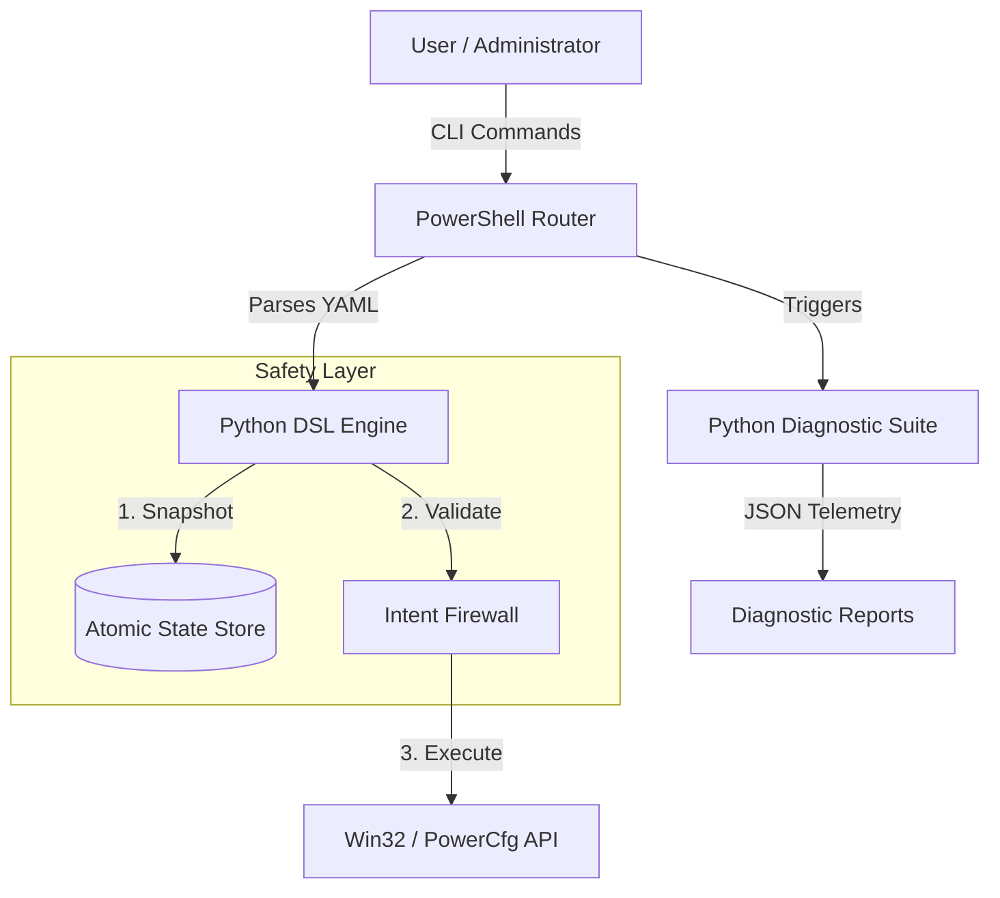

# 🔋 PowerTune

### The Evidence-Driven Systems Observability & Power Intelligence Platform for Windows

[](https://github.com/Sarvadnya07/powertune/actions/workflows/ci.yml)
[](https://opensource.org/licenses/MIT)
[](https://www.python.org/downloads/)
[](https://microsoft.com/PowerShell)
[]()

---

## 📖 Overview

**PowerTune** is not another "optimization script" or a collection of registry hacks. It is a high-performance **Systems Observability & Power Intelligence Platform** designed for Windows. 

Built for Systems Engineers, Developers, and Performance Enthusiasts, PowerTune replaces dangerous, opaque scripts with a **transparent, declarative, and evidence-driven** framework. It provides deep visibility into hardware behavior—from GPU residency and CPU C-states to timer resolution abuse—and applies optimizations through a **Zero-Trust Intent Firewall**.

### Why PowerTune?
Most "windows optimizers" are black boxes that can break OS stability. PowerTune is different:
- **Evidence-First**: Every optimization is justified by measurable telemetry.
- **Zero-Trust**: Hardcoded safeguards prevent modification of critical OS components.
- **Atomic Safety**: Granular hexadecimal snapshots allow for instant, 100% reversible rollbacks.

---

## ✨ Core Features

| Feature | Description |
| :--- | :--- |
| 🛡️ **Intent Firewall** | A security-first sandbox that blocks changes to critical services (Defender, RPC, etc.). |
| 🧩 **Declarative DSL** | Define system states in type-safe YAML profiles instead of imperative scripts. |
| 📉 **Deep Observability** | Python-based analyzers for GPU residency, WMI battery wear, and platform timers. |
| 🔁 **Atomic Rollbacks** | Captures CPU P-States and registry snapshots before execution for 1:1 restoration. |
| 📊 **Unified Telemetry** | High-fidelity JSON output suitable for AI-driven analytics and enterprise monitoring. |
| ⚡ **Benchmarking** | Integrated validation to prove wattage reduction and latency improvements. |

---

## 🖼️ Dashboard & Analytics


*Note: The CLI provides a rich, interactive dashboard for real-time systems diagnostics.*

---

## 🏗️ Architecture

PowerTune uses a decoupled, strict boundary execution model to ensure stability and security.



---

## 🚀 Getting Started

### Prerequisites
- **Windows 10/11**
- **Python 3.10+** (Required for analyzers and engine)
- **PowerShell 5.1+** (Admin privileges required for applying optimizations)

### Installation

```powershell
# Clone the repository
git clone https://github.com/Sarvadnya07/powertune.git
cd powertune

# Run the automated installer (Sets up environment and PATH)
.\install.ps1
```

---

## 💻 Usage

PowerTune is built around a single entry point: `powertune.ps1`.

### 1. Run Diagnostics (Read-Only)
Analyze the system without making any changes. This checks for GPU wakeups, timer resolution abuse, and battery health.
```powershell
powertune analyze
```

### 2. Apply an Optimization Profile
Apply a predefined configuration. This generates an atomic rollback snapshot automatically.
```powershell
powertune battery -Apply
```

### 3. Emergency Restore
Instantly revert all changes to the exact state captured before the last optimization.
```powershell
powertune restore -Apply
```

### 4. Interactive Dashboard
Launch the full interactive TUI dashboard.
```powershell
.\cli\launcher.bat
```

---

## 🔌 Writing Profiles (DSL)

Optimizations are defined in `profiles/*.yaml`. PowerTune enforces rationale for every tweak.

```yaml
profile: "developer"
description: "High CPU compile speed, aggressive background suspension."
tweaks:
  - id: cpu_min_state
    value: 85
    risk: Low
    why: "Prevents CPU from entering deep C-states during frequent compilation workloads."
    
  - id: service_disable
    target: "SysMain"
    risk: Medium
    why: "Reduces disk I/O and background indexing during active development."
```

---

## 📂 Project Structure

```text
powertune/
├── analyzers/          # Python diagnostic modules (CPU, GPU, Battery, etc.)
├── cli/                # PowerShell command router and launchers
├── core/               # Python DSL engine and telemetry logic
├── profiles/           # Declarative YAML optimization profiles
├── rollback/           # Hexadecimal state snapshots and restore scripts
├── tests/              # Security and functional test suite
├── docs/               # Technical documentation and architecture
└── reports/            # Generated JSON telemetry and change logs
```

---

## 🛠️ Tech Stack

- **Logic**: Python 3.10+ (using `subprocess`, `yaml`, `wmi`)
- **Orchestration**: PowerShell (Native Windows automation)
- **Data Format**: YAML (Profiles), JSON (Telemetry)
- **APIs**: Win32 API, `powercfg`, WMI, `nvidia-smi`

---

## 🤝 Contributing

We enforce a **Zero-Placebo Policy**. All pull requests that introduce new optimizations must include benchmark data proving a reduction in power consumption or latency.

1. Fork the Project
2. Create your Feature Branch (`git checkout -b feature/AmazingFeature`)
3. Commit your Changes (`git commit -m 'Add some AmazingFeature'`)
4. Push to the Branch (`git push origin feature/AmazingFeature`)
5. Open a Pull Request

See [CONTRIBUTING.md](CONTRIBUTING.md) for more details.

---

## 📄 License

Distributed under the MIT License. See `LICENSE` for more information.

---

## 👤 Author

**Sarvadnya** - [@Sarvadnya07](https://github.com/Sarvadnya07)

Project Link: [https://github.com/Sarvadnya07/powertune](https://github.com/Sarvadnya07)
