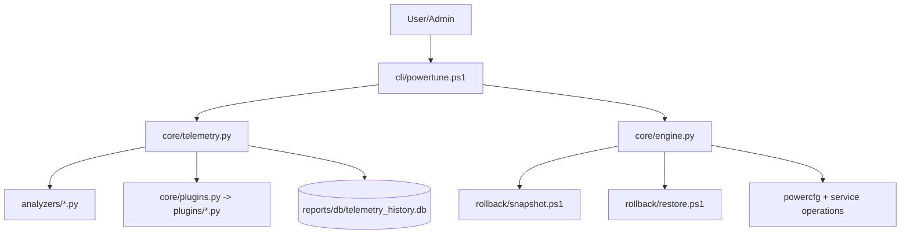

# PowerTune

High-fidelity Windows power observability and controlled optimization with rollback-first safety.

## 1. Project Title + Professional Tagline
PowerTune is a Windows-first telemetry workstation: diagnose power drains, prove root cause, and apply reversible tuning profiles with explicit risk and rationale.

## 2. High-Quality Badges
[](https://github.com/Sarvadnya07/powertune/actions/workflows/ci.yml)
[](https://github.com/Sarvadnya07/powertune/actions/workflows/lint.yml)
[](LICENSE)
[](https://www.python.org/)
[](https://learn.microsoft.com/powershell/)

## 3. Overview
PowerTune is not a "registry-tweak pack". It is a measurable and auditable optimization workflow for Windows laptops/desktops:
- run an analyzer suite (battery, CPU, GPU residency, timers, sleep blockers, thermal)
- persist telemetry to local history (SQLite) for comparison over time
- apply a declarative YAML profile through a safety-aware engine
- take a rollback snapshot before making any change (when `-Apply` is used)

## 4. Why This Project Exists
Most optimizer scripts are opaque (what changed?) and unsafe (how do we roll back?). PowerTune is built around three invariants:
1. Dry-run is the default.
2. Every mutable change has a rationale and risk metadata.
3. Apply flows create a recoverable snapshot and provide a restore path.

## 5. Key Features
- Evidence-first diagnostics: analyzers emit structured events (`category`, `severity`, `source`, `message`)
- YAML profiles with an explicit tweak registry (`cpu_min_state`, `cpu_max_state`, `active_scheme`, `service_disable`)
- Intent firewall: blocks critical service operations and validates service names to reduce injection risk
- Rollback-first execution: snapshot before mutation; restore path available via CLI
- Plugin system for OEM/custom telemetry (`plugins/*.py` exposes `get_telemetry()`)
- Local telemetry history store (`reports/db/telemetry_history.db`)

## 6. Screenshots / Demo Section
- Desktop launcher: `cli/launcher.bat`
- PowerShell CLI: `cli/powertune.ps1 help`
- Dashboard generator: `cli/powertune.ps1 dashboard`

UI references and design work live under `desktop/` (React + Tauri).

## 7. Architecture Overview

```mermaid
flowchart TD
  U[User/Admin] --> PS[cli/powertune.ps1]
  PS --> TEL[core/telemetry.py]
  PS --> ENG[core/engine.py]
  TEL --> AN[analyzers/*.py]
  TEL --> PL[core/plugins.py -> plugins/*.py]
  TEL --> DB[(reports/db/telemetry_history.db)]
  ENG --> SNAP[rollback/snapshot.ps1]
  ENG --> REST[rollback/restore.ps1]
  ENG --> SYS[powercfg + service operations]
```

## 8. Tech Stack
- Python: core engine, telemetry pipeline, analyzers, SQLite persistence
- PowerShell: routing CLI, rollback scripts, vendor detection modules
- Data formats: YAML (profiles), JSONL (change logs), SQLite (history)
- Windows surfaces: `powercfg`, `Get-Service`, CIM/WMI, ETW-derived analysis (where implemented)

## 9. Folder Structure (tree format)
```text
powertune/
|-- analyzers/                 # Diagnostic analyzers
|-- cli/                       # PowerShell router + launcher
|-- core/                      # Engine, telemetry, UI, DB, plugins
|-- desktop/                   # React + Tailwind + Tauri workstation UI
|-- docs/                      # Deep technical docs, wiki, whitepapers
|-- plugins/                   # Optional runtime plugins (get_telemetry)
|-- profiles/                  # YAML profiles + PS fallbacks
|-- reports/                   # Generated telemetry, db, and logs
|-- rollback/                  # Snapshot + restore scripts
|-- tests/                     # Safety and regression tests
|-- vendor/                    # OEM modules (asus/lenovo/dell/hp)
|-- install.ps1                # Environment bootstrap
|-- build.ps1                  # Optional PyInstaller packaging
`-- powertune.py               # Python CLI entrypoint
```

## 10. Installation Guide
Quick install (recommended):
```powershell
git clone https://github.com/Sarvadnya07/powertune.git
cd powertune
.\install.ps1
```

Manual (virtualenv):
```powershell
python -m venv .venv
.\.venv\Scripts\Activate.ps1
pip install -r requirements.txt
```

## 11. Environment Variables Setup
No mandatory environment variables.

Optional:
- Add `<repo>\cli` to User `PATH` to call `powertune.ps1` globally.

## 12. Configuration Guide
Profiles live in `profiles/*.yaml` and are executed by `core/engine.py`.

Profile schema (current engine):
```yaml
profile: battery
description: Maximize idle efficiency and battery life
tweaks:
  - id: cpu_min_state
    value: 5
    risk: Low
    why: "Allows CPU to enter deeper C-states and reduces idle package power."
```

Supported tweak IDs (see `core/engine.py`):
- `cpu_min_state` / `cpu_max_state`: power policy adjustments via `powercfg`
- `active_scheme`: set active Windows power scheme by GUID
- `service_disable`: stop a non-critical service (guarded by blocklist + regex validation)

## 13. Usage Instructions
PowerShell (recommended operator entrypoint):
```powershell
.\cli\powertune.ps1 analyze
.\cli\powertune.ps1 battery          # dry-run
.\cli\powertune.ps1 battery -Apply   # requires Administrator
.\cli\powertune.ps1 restore -Apply   # requires Administrator
```

Python (developer entrypoint):
```powershell
python powertune.py analyze
python powertune.py battery --apply
```

## 14. API Documentation Overview
PowerTune is a local workstation CLI, not a network API service.

Internal APIs for contributors:
- Engine: `execute_profile(...)` in `core/engine.py`
- Telemetry: `collect_telemetry(...)` and `generate_recommendations(...)` in `core/telemetry.py`
- Plugins: `get_telemetry()` contract in `plugins/*.py`

See `API_GUIDE.md`.

## 15. Authentication Flow (if applicable)
No user authentication (no accounts/tokens).

Privilege boundary:
- `-Apply` requires local admin elevation (PowerShell router checks admin)
- intent firewall blocks critical service operations regardless of elevation

## 16. Performance Optimizations
- Analyzer fan-out runs concurrently via `ThreadPoolExecutor` (`core/telemetry.py`)
- Bounded subprocess timeouts prevent "hang forever" failure modes
- SQLite persistence enables fast historical lookup without re-running heavy diagnostics

## 17. Security Measures
- Dry-run default for profiles (explicit `-Apply` required to mutate)
- Service-name validation to reduce command-injection style payloads
- Critical services blocklist (Defender, RPC, DHCP, WMI, etc.)
- Rollback snapshot captured before any mutation when apply mode is used

## 18. Scalability Considerations
- Plugin architecture supports incremental analyzer growth without core edits
- SQLite works for local-node history; can be swapped for an external sink later
- Profiles are declarative and reviewable (safer change review than imperative scripts)

## 19. Testing Instructions
```powershell
pytest -q
```

Current status (local run on 2026-05-27): 7 passed, 2 failed.
The failures are expectation mismatches: tests expect `SystemExit`, engine raises `SecurityViolationError`.

## 20. Deployment Guide
PowerTune is endpoint software for Windows devices (developer workstation or managed fleet).

Recommended rollout flow:
1. Install dependencies (or package binaries).
2. Run `analyze` and capture baseline telemetry.
3. Apply profiles only under operator policy and with snapshot/restore verification.
4. Persist logs and snapshots for audit.

See `DEPLOYMENT.md`.

## 21. Contributing Guidelines
See `CONTRIBUTING.md` and `.github/PULL_REQUEST_TEMPLATE.md`.

## 22. Roadmap
See `FUTURE_SCOPE.md` and `ROADMAP.md`.

## 23. License
MIT. See `LICENSE`.

## 24. Author / Credits
- Sarvadnya
- Open-source contributors (see `CONTRIBUTING.md`)

