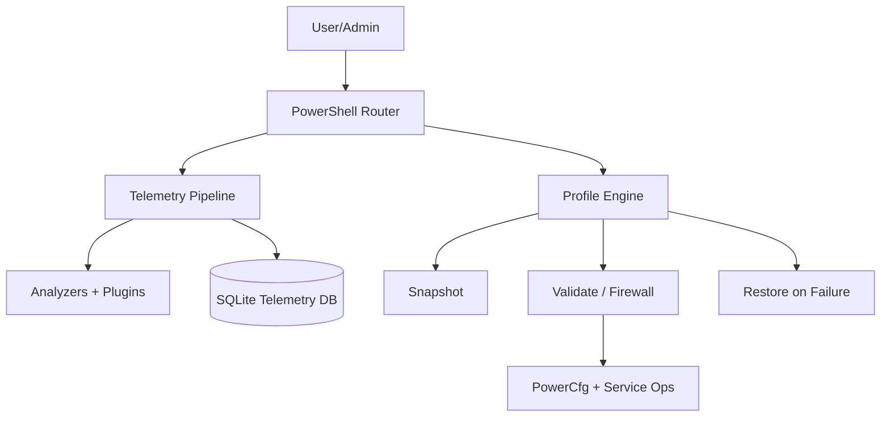

# PowerTune

**Evidence-driven Windows power diagnostics, safe profile tuning, and reversible system optimization**

[](https://github.com/Sarvadnya07/powertune/actions/workflows/ci.yml)
[](https://github.com/Sarvadnya07/powertune/actions/workflows/lint.yml)
[](LICENSE)
[](https://www.python.org/)
[](https://learn.microsoft.com/powershell/)

## Overview
PowerTune is a Windows-first optimization platform that combines telemetry analyzers, a YAML profile engine, rollback snapshots, and safety guardrails into one operator-friendly toolkit.

## Why This Project Exists
Classic tweak scripts are fast but risky. PowerTune is designed to make optimization measurable, reversible, and auditable.

## Key Features
- Concurrent telemetry analyzers (GPU, sleep states, timers, thermal, attribution)
- YAML-driven tuning profiles with risk + rationale metadata
- Intent firewall for critical-service protection
- Atomic snapshot + restore workflow before mutable operations
- Plugin discovery for custom telemetry modules
- SQLite event history for trend inspection

## Screenshots / Demo
- Launcher: `./cli/launcher.bat`
- CLI help: `./cli/powertune.ps1 help`
- Dashboard command: `./cli/powertune.ps1 dashboard`

## Architecture Overview

```mermaid
flowchart TD
  A[User/Admin] --> B[PowerShell Router]
  B --> C[Telemetry Pipeline]
  B --> D[Profile Engine]
  C --> E[Analyzers + Plugins]
  C --> F[(SQLite Telemetry DB)]
  D --> G[Snapshot]
  D --> H[Validate / Firewall]
  H --> I[PowerCfg + Service Ops]
  D --> J[Restore on Failure]
```

## Tech Stack
- Python 3.10+: analyzers, engine, telemetry, persistence
- PowerShell 5.1+: orchestration, install, rollback, OEM checks
- YAML + JSON + SQLite: profiles, logs, and history

## Folder Structure
```text
powertune/
|- analyzers/        |- cli/            |- core/
|- docs/             |- plugins/        |- profiles/
|- rollback/         |- tests/          |- vendor/
|- install.ps1       |- build.ps1       `- powertune.py
```

## Installation Guide
```powershell
git clone https://github.com/Sarvadnya07/powertune.git
cd powertune
.\install.ps1
```

## Environment Variables Setup
No mandatory env vars. Optional: add `cli` path to User `PATH` for global command usage.

## Configuration Guide
Profiles live in `profiles/*.yaml`. Supported tweak IDs in `core/engine.py`:
- `cpu_min_state`
- `cpu_max_state`
- `active_scheme`
- `service_disable`

## Usage Instructions
```powershell
.\cli\powertune.ps1 analyze
.\cli\powertune.ps1 battery
.\cli\powertune.ps1 battery -Apply
.\cli\powertune.ps1 restore -Apply
python powertune.py analyze
```

## API Documentation Overview
PowerTune exposes internal Python APIs, not HTTP endpoints. See `API_GUIDE.md`.

## Authentication Flow
No identity auth layer. Privilege boundary is local admin elevation for `-Apply` operations.

## Performance Optimizations
- Analyzer fan-out using `ThreadPoolExecutor`
- Targeted subprocess timeouts to avoid hangs
- Local persistence to reduce repeated investigation cost

## Security Measures
- Dry-run by default
- Blocklist for critical Windows services
- Service-name validation to reduce injection risk
- Pre-change snapshot + explicit rollback path

## Scalability Considerations
- Plugin model supports incremental analyzer growth
- SQLite is suitable for local-node scale; easy to replace with external store later
- YAML DSL allows controlled optimization-policy evolution

## Testing Instructions
```powershell
pytest -q
```
Status on 2026-05-27 local run: `7 passed, 2 failed` (tests expect `SystemExit` while engine raises `SecurityViolationError`).

## Deployment Guide
See `DEPLOYMENT.md` for endpoint rollout, CI/CD, and release hardening guidance.

## Contributing Guidelines
See `CONTRIBUTING.md`.

## Roadmap
See `FUTURE_SCOPE.md` and `ROADMAP.md`.

## License
MIT.

## Author / Credits
- Sarvadnya
- Open-source contributors
