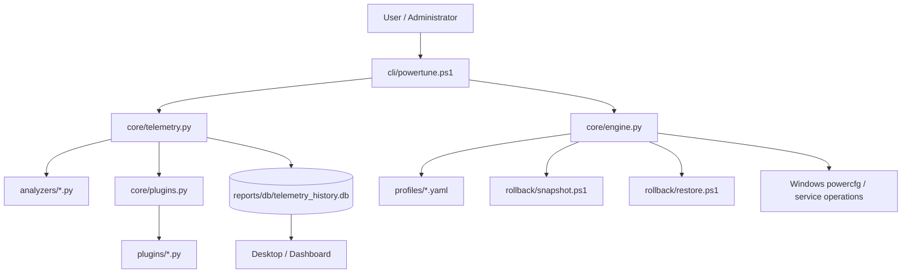

⚡ PowerTune
> **Evidence-driven Windows power observability, diagnosis, and controlled optimization with rollback-first safety.**


Overview
PowerTune is a production-oriented Windows systems engineering and telemetry workstation for diagnosing power consumption, identifying root causes, measuring thermal and hardware efficiency, and applying controlled optimization profiles safely.
Rather than acting as a collection of opaque registry tweaks, PowerTune provides a measurable and auditable workflow:
Run a coordinated analyzer suite covering battery, CPU, GPU residency, timers, sleep blockers, and thermal behavior.
Collect evidence from Windows telemetry and system surfaces, including ETW-derived analysis where implemented.
Persist telemetry locally in SQLite for historical comparison.
Generate structured recommendations with severity, source, category, and rationale.
Apply declarative YAML optimization profiles through a safety-aware execution engine.
Capture a rollback snapshot before mutations in apply mode.
Restore the previous known state through an explicit recovery path.
PowerTune is designed for Windows laptops, desktops, developer workstations, and controlled endpoint rollouts where observability and reversibility matter as much as optimization.
Why PowerTune Exists
Modern Windows systems can exhibit opaque power-state behavior, unexpected background activity, thermal inefficiency, and difficult-to-explain battery or idle drain.
Traditional optimizer scripts often leave two questions unanswered:
What exactly changed?
How do I safely undo it?
PowerTune is built around three core invariants:
Dry-run is the default.
Every mutable change carries rationale and risk metadata.
Apply operations create a recoverable snapshot before mutation.
The goal is not simply to change settings, but to observe → diagnose → explain → apply → verify → restore.
Key Features
🔍 Evidence-First Diagnostics
PowerTune aggregates structured telemetry from multiple diagnostic surfaces:
Battery and power-state information
CPU C-state residency
GPU residency
Timer activity
Sleep blockers
Thermal information
ETW-derived telemetry where implemented
Windows power configuration
Vendor-specific telemetry through plugins
Analyzer results are emitted as structured events containing fields such as:
```text
category
severity
source
message
```
This makes findings easier to inspect, persist, compare, and audit.
🧠 Intelligence & Root-Cause Analysis
The telemetry pipeline can transform raw observations into recommendations intended to identify likely sources of:
Parasitic idle drain
Inefficient power states
Sleep/standby blockers
CPU residency issues
ASPM-related power-management behavior where implemented
Unnecessary background activity
Recommendations are designed to be evidence-driven rather than based on a generic “power saver” preset.
🛡️ Rollback-First Optimization
PowerTune treats configuration changes as controlled transactions:
Profiles run in dry-run mode unless explicitly applied.
Apply mode requires administrator privileges.
A rollback snapshot is captured before mutable operations.
Restore scripts provide an explicit recovery path.
Critical service operations are blocked by policy.
This allows optimization to be evaluated without turning every experiment into a permanent system modification.
🔒 Security & Intent Firewall
PowerTune includes safety controls around system mutation:
Critical-service blocklists
Service-name validation
Explicit apply mode
Administrative privilege checks
Controlled profile parsing
Bounded subprocess execution
Snapshot-before-mutation behavior
The intent firewall is designed to prevent dangerous service operations and reduce command-injection-style risks.
📊 Telemetry History
Collected telemetry can be persisted to:
```text
reports/db/telemetry_history.db
```
SQLite history enables comparison across runs without repeatedly performing expensive diagnostics.
🔌 Plugin Architecture
OEM and custom integrations can be added through `plugins/`.
Plugins expose a simple telemetry contract such as:
```python
get_telemetry()
```
This allows vendor-specific data sources to be incorporated without modifying the central telemetry engine.
📈 Interactive Workstation Dashboard
PowerTune includes a desktop visualization layer based on React + Tailwind + Tauri, alongside CLI tooling.
Available operator surfaces include:
```powershell

.\cli\powertune.ps1 help
.\cli\powertune.ps1 dashboard
```
The desktop implementation and UI work live under `desktop/`.
Architecture
PowerTune uses a modular, event-driven architecture organized around collection, intelligence, execution, persistence, and presentation.

```mermaid
flowchart TD
  U[User / Administrator] --> PS[cli/powertune.ps1]

  PS --> TEL[core/telemetry.py]
  PS --> ENG[core/engine.py]

  TEL --> AN[analyzers/*.py]
  TEL --> PL[core/plugins.py]
  PL --> OEM[plugins/*.py]
  TEL --> DB[(reports/db/telemetry_history.db)]

  ENG --> PROF[profiles/*.yaml]
  ENG --> SNAP[rollback/snapshot.ps1]
  ENG --> REST[rollback/restore.ps1]
  ENG --> SYS[Windows powercfg / service operations]

  DB --> DASH[Desktop / Dashboard]
```
Core Layers
Collectors & Analyzers — `analyzers/` gathers specialized diagnostic data.
Core Telemetry & Intelligence — `core/` handles telemetry collection, persistence, recommendations, plugins, and execution logic.
Execution & Safety — `core/engine.py` applies controlled profiles while `rollback/` handles snapshots and restoration.
Presentation — `cli/` provides operator-facing command routing while `desktop/` provides the graphical workstation experience.
Tech Stack
Area	Technology
Core engine	Python 3.10+

CLI / system control	PowerShell 5.1+
Desktop UI	React + Tailwind + Tauri
Profiles	YAML
Change logs	JSONL
Telemetry history	SQLite
Windows power control	`powercfg`
Service management	`Get-Service` / controlled service operations
System information	CIM / WMI
Deep telemetry	ETW-derived analysis where implemented
Testing	Pytest
Packaging	Optional PyInstaller workflow
Project Structure
```text
powertune/
|-- analyzers/                 # Diagnostic probes: ETW, timers, thermals, etc.
|-- cli/                       # PowerShell router, CLI, launcher, dashboard commands
|-- core/                      # Engine, telemetry, intelligence, DB, plugins
|-- desktop/                   # React + Tailwind + Tauri workstation UI
|-- docs/                      # Technical documentation, specifications, wiki, whitepapers
|-- plugins/                   # Optional runtime telemetry plugins
|-- profiles/                  # Declarative YAML optimization profiles
|-- reports/                   # Generated telemetry, database, logs, and reports
|-- rollback/                  # Snapshot and restore scripts
|-- tests/                     # Safety, regression, and integration tests
|-- vendor/                    # OEM modules: ASUS, Lenovo, Dell, HP
|-- install.ps1                # Environment bootstrap
|-- build.ps1                  # Optional packaging workflow
|-- powertune.py               # Python CLI entrypoint
|-- API_GUIDE.md               # Internal API documentation
|-- DEPLOYMENT.md              # Deployment guidance
|-- CONTRIBUTING.md            # Contribution guidelines
|-- FUTURE_SCOPE.md            # Future capabilities
`-- ROADMAP.md                 # Development roadmap
```
Requirements
Windows 10 or Windows 11
Python 3.10+
PowerShell 5.1+
Administrator privileges for operations that mutate protected system state
Git for source installation
No mandatory environment variables are required.
Optional PATH Configuration
To invoke the PowerShell CLI globally, add:
```text
<repo>\cli
```
to the user `PATH`.
Installation
Recommended Installation
```powershell
git clone https://github.com/Sarvadnya07/powertune.git
cd powertune
.\install.ps1
```
Manual Virtual Environment Setup
```powershell
python -m venv .venv
.\.venv\Scripts\Activate.ps1
pip install -r requirements.txt
```
Configuration
PowerTune uses declarative profiles stored under:
```text
profiles/*.yaml
```
Profiles are interpreted by:
```text
core/engine.py
```
Example Profile
```yaml
profile: battery
description: Maximize idle efficiency and battery life

tweaks:
  - id: cpu_min_state
    value: 5
    risk: Low
    why: "Allows CPU to enter deeper C-states and reduces idle package power."
```
Supported Tweak IDs
Current engine-supported IDs include:
`cpu_min_state` — adjust CPU minimum power-state policy through `powercfg`
`cpu_max_state` — adjust CPU maximum power-state policy through `powercfg`
`active_scheme` — activate a Windows power scheme by GUID
`service_disable` — stop a non-critical service subject to safety validation and blocklists
Profiles should remain reviewable, declarative, and explicit about the rationale and risk of each change.
Usage
Analyze Current Power State
PowerShell:
```powershell
.\cli\powertune.ps1 analyze
```
Python:
```powershell
python powertune.py analyze
```
For deeper analysis where supported:
```powershell
python powertune.py analyze --deep
```
Preview a Battery Optimization
By default, optimization remains in dry-run mode:
```powershell

```
or:
```powershell
python powertune.py battery
```
Apply a Profile
Applying a profile requires Administrator privileges:
```powershell
.\cli\powertune.ps1 battery -Apply
```
or:
```powershell
python powertune.py battery --apply
```
The engine performs safety checks and captures the rollback state before mutation.
Restore Previous State
```powershell
.\cli\powertune.ps1 restore -Apply
```
For direct rollback tooling:
```powershell
.\rollback\restore.ps1 -Latest
```
Launch Dashboard
```powershell
.\cli\powertune.ps1 dashboard
```
Get CLI Help
```powershell
.\cli\powertune.ps1 help
```
Operational Workflow
A typical PowerTune session follows this sequence:
```text
Baseline
   ↓
Analyze
   ↓
Collect Evidence
   ↓
Generate Recommendations
   ↓
Review Profile + Risk
   ↓
Dry Run
   ↓
Snapshot
   ↓
Apply
   ↓
Re-analyze
   ↓
Compare Results
   ↓
Keep or Restore
```
This workflow makes optimization measurable and reversible rather than purely speculative.
Internal API Overview
PowerTune is a local workstation application, not a network API service.
Engine
```python
execute_profile(...)
```
Located in `core/engine.py`.
Telemetry
```python
collect_telemetry(...)
generate_recommendations(...)
```
Located in `core/telemetry.py`.
Plugins
```python
get_telemetry()
```
Implemented by plugins under `plugins/*.py`.
See `API_GUIDE.md` for contributor-facing API details.
Authentication & Privilege Model
PowerTune does not use accounts, API tokens, or network authentication.
Instead, it uses the local Windows privilege boundary:
Read-only diagnostics can run without mutation privileges where supported.
`-Apply` operations require local Administrator elevation.
The PowerShell router checks privilege state.
The intent firewall blocks protected service operations even when elevated.
Performance
PowerTune is designed to avoid unnecessary blocking during analysis and execution.
Key techniques include:
Concurrent analyzer fan-out through `ThreadPoolExecutor`
Bounded subprocess timeouts
SQLite-backed historical lookups
Modular plugin execution
Declarative profiles that avoid repeated imperative scripting
Scalability
PowerTune is primarily designed for local endpoint workloads but its architecture supports future expansion:
Plugins allow additional telemetry sources without rewriting core logic.
SQLite provides efficient local-node history storage.
The persistence layer can later be adapted to external sinks.
Declarative profiles support controlled rollout and review.
Vendor modules can provide OEM-specific integrations.
Security Model
Security-sensitive operations are intentionally constrained.
Dry-Run by Default
Profiles do not mutate the system unless the operator explicitly requests apply mode.
Service Protection
`service_disable` operations are restricted by:
Service-name validation
Critical-service blocklists
Controlled execution paths
Snapshot Before Mutation
Apply operations capture recoverable state before changing configuration.
Bounded Execution
External system commands use bounded timeouts to reduce indefinite hangs.
Testing
Run the test suite with:
```powershell
pytest -q
```
Tests cover safety and regression behavior across the engine and supporting components.
> **Note:** Keep test status aligned with the latest CI/local run rather than embedding an outdated historical result in this README.
Deployment
PowerTune is endpoint software intended for:
Developer workstations
Power-user systems
Windows laptops and desktops
Controlled managed-device rollouts
Recommended rollout process:
Install dependencies or deploy the packaged application.
Run `analyze` to capture baseline telemetry.
Review findings and recommendations.
Dry-run the intended profile.
Apply only under an appropriate operator policy.
Verify rollback snapshot creation.
Re-run telemetry after changes.
Compare before/after results.
Retain logs and snapshots required for audit or recovery.
See `DEPLOYMENT.md` for deployment-specific guidance.
Screenshots / Demo
PowerTune provides multiple operator entry points:
```text
Desktop launcher:   cli/launcher.bat
PowerShell CLI:     cli/powertune.ps1 help
Dashboard:          cli/powertune.ps1 dashboard
```
UI references, design assets, and desktop implementation live under:
```text
desktop/
```
Add project screenshots, recordings, or benchmark results here as the UI matures.
Contributing
Contributions are welcome.
Before opening a pull request, review:
`CONTRIBUTING.md`
`.github/PULL_REQUEST_TEMPLATE.md`
Please maintain the project's safety model, test coverage, clear rationale for mutable operations, and documentation quality when introducing new capabilities.
Roadmap
Long-term development is documented in:
```text
ROADMAP.md
FUTURE_SCOPE.md
```
Potential expansion areas include broader hardware telemetry, additional OEM integrations, deeper diagnostics, richer historical analysis, and more comprehensive desktop visualization.
License
PowerTune is released under the MIT License.
See `LICENSE` for the full license text.
Author / Credits
Sarvadnya
Open-source contributors
See `CONTRIBUTING.md` for contribution history and project participation.
---
Design Principles
PowerTune is guided by a small set of engineering principles:
> **Measure before changing.**  
> **Explain before applying.**  
> **Snapshot before mutating.**  
> **Verify after optimizing.**  
> **Restore when results are not satisfactory.**
The objective is not to maximize the number of tweaks applied to a Windows installation. The objective is to build a repeatable, evidence-driven, reviewable, and reversible power-management workflow.