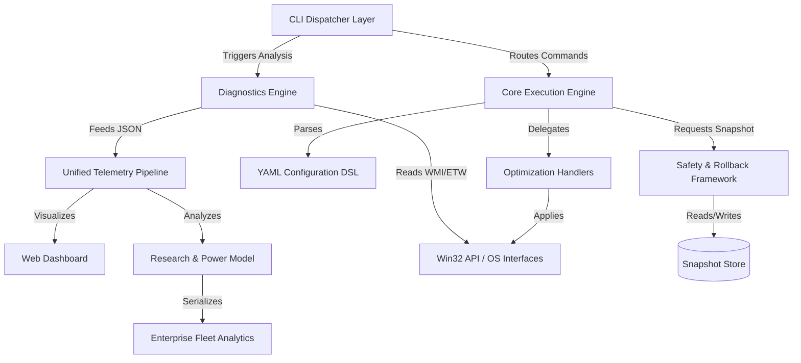

# PowerTune Internal Architecture

This document defines the strict boundaries and data flow of the PowerTune platform. Our architecture is designed to guarantee safe, transactional execution of system optimizations.

## 🏗️ Layered Architecture

### 1. CLI Dispatcher Layer (`powertune.ps1`)
The user-facing router. It handles argument parsing, basic privilege checking (UAC), and vendor hardware detection. It is deliberately kept lightweight.

### 2. Diagnostics Engine (`analyzers/`)
A collection of Python-based read-only probes. 
- **Rule**: Analyzers must never mutate state.
- **Rule**: Analyzers must output structured data (or strict JSON) for downstream consumption.

### 3. Core Execution Engine (`core/engine.py`)
The heart of the platform. It translates declarative YAML configurations into Object-Oriented Command classes.
- Implements the **Transaction-Based Optimization** model:
  `Backup -> Validate -> Apply -> Verify -> Commit`
- Catches exceptions and triggers automatic failure recovery.

### 4. Safety & Rollback Framework (`rollback/`)
Guarantees absolute system reversibility.
- Takes binary/hexadecimal snapshots of ACPI/Processor states before any optimization layer is invoked.

### 6. Research & Power Attribution (`core/power_model.py`)
Provides mathematical validation for diagnostic findings. It converts raw CPU/GPU metrics into estimated hourly battery impact (mWh), allowing for evidence-driven optimization prioritizations.

### 7. Enterprise Fleet Analytics (`core/fleet.py`)
An experimental layer that standardizes local telemetry into JSON payloads for centralized cloud monitoring. It handles device UUID generation and compliance-policy checking for IT departments managing laptop fleets.
